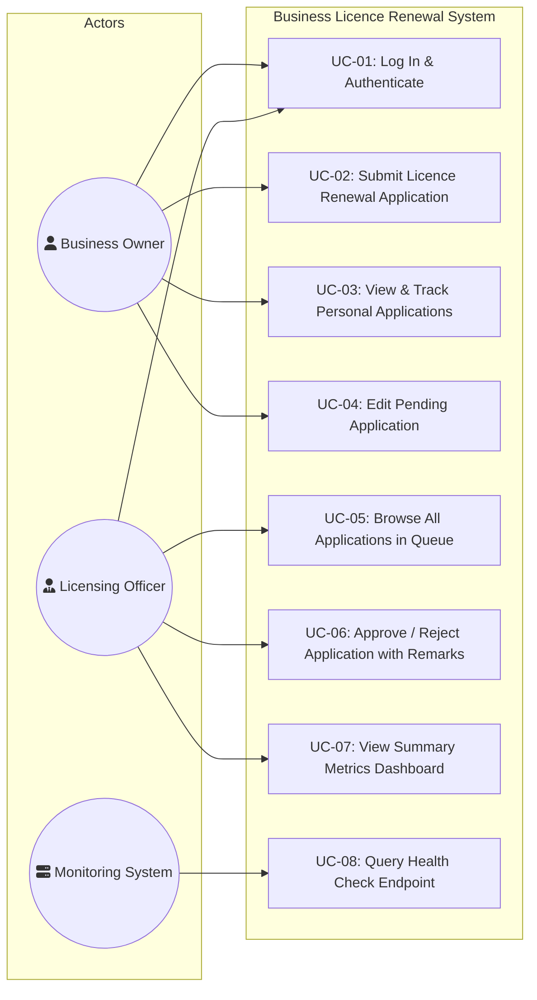
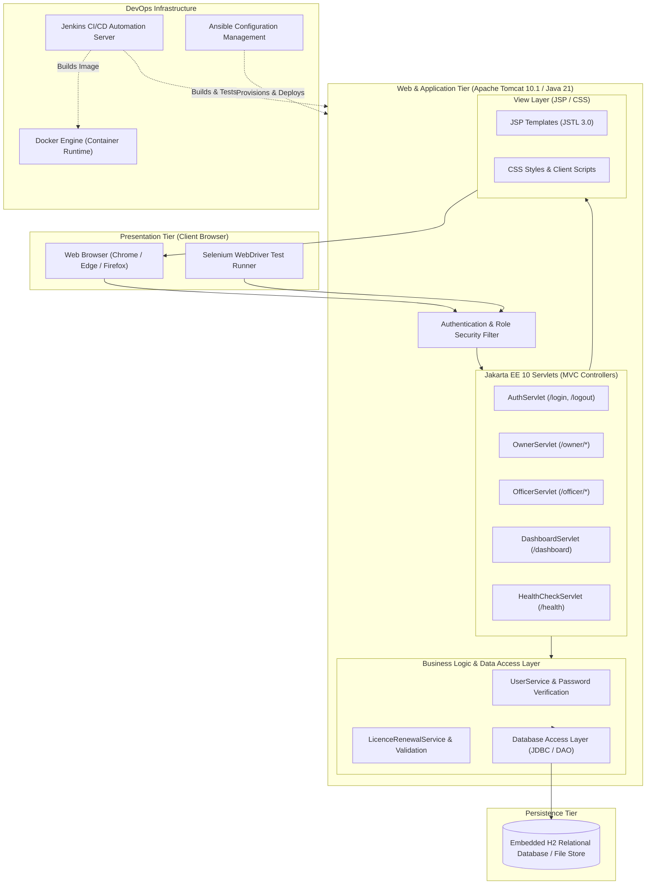
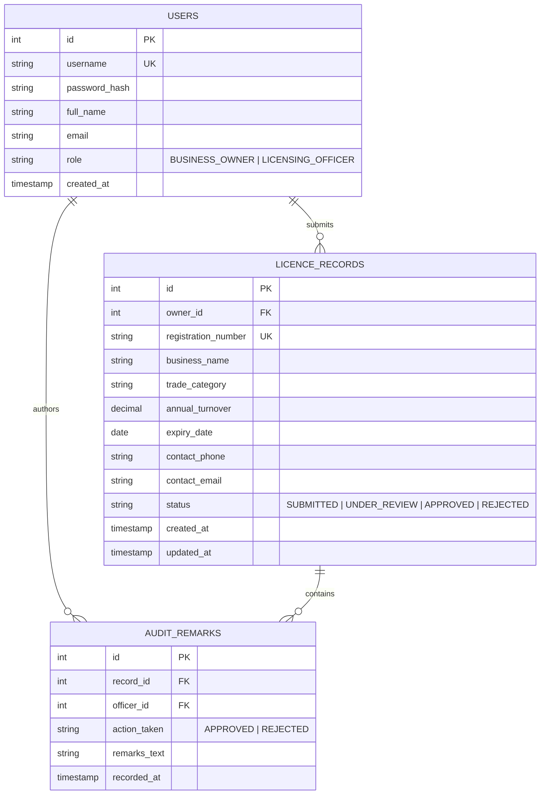

# Software Requirements Specification (SRS), Architecture & Data Model

This document specifies the software requirements, system architecture, data models, web endpoints, and local developer setup instructions for the **Business Licence Renewal System**.

---

## 1. Software Requirements Specification (SRS) Summary

### 1.1 Functional Requirements (FR)

| Req ID | Requirement Title | Detailed Description | Priority |
|---|---|---|---|
| **FR-01** | User Authentication | System shall authenticate users via username and password against stored secure credentials. | High |
| **FR-02** | Role-Based Access Control | System shall enforce two distinct roles on the server side: `BUSINESS_OWNER` and `LICENSING_OFFICER`. | High |
| **FR-03** | Create Licence Renewal | Business owners shall submit new licence renewal applications specifying business name, registration number, category, turnover, expiry date, and contact details. | High |
| **FR-04** | Horizontal Data Scoping | Business owners shall be strictly restricted to accessing, viewing, and updating only applications created under their own authenticated account. | High |
| **FR-05** | View & Search Applications | Users shall be able to search renewal records by business registration number, business name, or status. | High |
| **FR-06** | Update Pending Application | Business owners shall be permitted to modify application details only while status remains in the `SUBMITTED` state. | Medium |
| **FR-07** | Officer Review & Decision | Licensing officers shall have the capability to inspect any application in their jurisdiction and record a decision (`APPROVED` or `REJECTED`). | High |
| **FR-08** | Mandatory Decision Remarks | Any approval or rejection decision recorded by an officer must include mandatory justification remarks. | High |
| **FR-09** | Summary Dashboard | System shall display real-time counters showing total applications, pending submissions, approved count, and rejected count. | Medium |
| **FR-10** | System Health Endpoint | System shall expose an unauthenticated HTTP GET `/health` endpoint returning server status, version, and JVM metadata in JSON format. | High |

### 1.2 Non-Functional Requirements (NFR)

| Req ID | Category | Requirement Specification |
|---|---|---|
| **NFR-01** | Security | Enforce server-side session authentication on all protected routes. Passwords must never be logged or stored in plain text. HTTP 403 Forbidden returned on unauthorized record access. |
| **NFR-02** | Compatibility | Fully compatible with Java 21 LTS and Apache Tomcat 10.1+ adhering strictly to the Jakarta EE 10 (Servlet 6.0) specification. |
| **NFR-03** | Build Portability | System must build cleanly on any Windows, macOS, or Linux environment using the provided Maven Wrapper (`mvnw` / `mvnw.cmd`) without requiring pre-installed Maven on the system PATH. |
| **NFR-04** | Performance | Web pages and API endpoints must respond in less than 500ms under standard local concurrency (10 concurrent users). |
| **NFR-05** | Data Integrity | Relational data persistence backed by transactional file-based or embedded database storage with foreign key integrity. |
| **NFR-06** | Testability | Web pages must use predictable HTML `id` and `name` attributes to facilitate automated Selenium WebDriver end-to-end testing. |
| **NFR-07** | Maintainability | Adherence to Model-View-Controller (MVC) architectural separation with modular Java packages. |
| **NFR-08** | Deployability | Packaged as a standard standalone WAR (`business-licence-renewal.war`) deployable to Tomcat, runnable inside Docker containers, and configurable via Ansible. |

---

## 2. Use-Case Model



---

## 3. System Architecture Diagram



---

## 4. Data Model (Entity-Relationship)



### Entity Attributes & Data Dictionary

1. **`USERS` Table**:
   - `id`: Primary key (Integer, Auto-increment).
   - `username`: Unique login handle (VARCHAR(50)).
   - `password_hash`: Salted PBKDF2-HMAC-SHA256 hash string.
   - `full_name`: Real name of the individual or authorized officer (VARCHAR(100)).
   - `email`: Contact email address (VARCHAR(120)).
   - `role`: Role discriminator (`BUSINESS_OWNER` or `LICENSING_OFFICER`).
   - `created_at`: Registration timestamp.

2. **`LICENCE_RECORDS` Table**:
   - `id`: Primary key (Integer, Auto-increment).
   - `owner_id`: Foreign key referencing `USERS.id` (Enforces horizontal scoping).
   - `registration_number`: Unique government registration code (e.g., `REG-2024-8841`).
   - `business_name`: Registered legal entity name (VARCHAR(150)).
   - `trade_category`: Industry classification (e.g., Retail, Food & Beverage, Tech).
   - `annual_turnover`: Reported financial turnover in INR.
   - `expiry_date`: Current licence expiration date (DATE).
   - `status`: Current lifecycle state (`SUBMITTED`, `UNDER_REVIEW`, `APPROVED`, `REJECTED`).
   - `created_at` / `updated_at`: Audit timestamps.

3. **`AUDIT_REMARKS` Table**:
   - `id`: Primary key (Integer, Auto-increment).
   - `record_id`: Foreign key referencing `LICENCE_RECORDS.id`.
   - `officer_id`: Foreign key referencing `USERS.id` (Authorizing officer).
   - `action_taken`: Decision outcome (`APPROVED` or `REJECTED`).
   - `remarks_text`: Required textual justification and audit comments.
   - `recorded_at`: Timestamp of decision.

---

## 5. Web & API Endpoints Specification

| HTTP Method | Route | Access Control | Purpose / Action |
|---|---|---|---|
| `GET` | `/` | Public | System landing page with status and navigation. |
| `GET` | `/health` | Public | JSON health-check endpoint for monitoring and Ansible verification. |
| `GET` | `/login` | Public | Renders user login form. |
| `POST` | `/login` | Public | Authenticates credentials and starts user session. |
| `POST` | `/logout` | Authenticated | Terminates active session and invalidates cookie. |
| `GET` | `/dashboard` | Authenticated | Redirects to role-specific dashboard based on session. |
| `GET` | `/owner/dashboard` | `BUSINESS_OWNER` | Displays business owner's personal applications table and search. |
| `GET` | `/owner/renew` | `BUSINESS_OWNER` | Renders application form for new licence renewal. |
| `POST` | `/owner/renew` | `BUSINESS_OWNER` | Processes and persists new licence renewal application. |
| `GET` | `/owner/records/view` | `BUSINESS_OWNER` | Views single record details (scoped strictly to session owner). |
| `GET` | `/officer/dashboard` | `LICENSING_OFFICER` | Displays officer review queue and metric summary cards. |
| `GET` | `/officer/records/review` | `LICENSING_OFFICER` | Displays detailed review screen for a submitted application. |
| `POST` | `/officer/records/decide` | `LICENSING_OFFICER` | Submits approval or rejection decision with mandatory remarks. |

---

## 6. Local Setup & Execution Guide (Windows)

### Prerequisites
- **Operating System**: Windows 10/11
- **Java**: Java JDK 21 LTS installed (verify with `java -version`)
- **Git**: Git for Windows installed (verify with `git --version`)
- **Maven**: Handled automatically via the project's included Maven Wrapper (`mvnw.cmd`). **No PATH configuration required.**

### Quick Start Commands

```powershell
# 1. Set JAVA_HOME in current PowerShell session
$env:JAVA_HOME = "C:\Program Files\Java\jdk-21"

# 2. Verify Maven Wrapper and Java 21 detection
.\mvnw.cmd -v

# 3. Clean, compile, and package the WAR artifact
.\mvnw.cmd clean package

# 4. Verify the built artifact
Get-Item target\business-licence-renewal.war
```


## 7. Current implementation notes — licence workflow

The diagrams above describe the proposed design. The implemented local MVP uses
`app_users` as a identity table seeded from the existing demo-user properties;
password hashes stay in `demo-users.properties` for the authentication stage.
`licence_records` references the owner and final reviewer, and `audit_remarks`
stores the decision in the same transaction as its status change. It is not a
registration system yet.

The implemented lifecycle is SUBMITTED → UNDER_REVIEW → APPROVED/REJECTED, with
approval/rejection also permitted directly from SUBMITTED. Owners can update or
delete only SUBMITTED records. Every mutation uses a POST form with CSRF checks.

Additional implemented routes (all take an `id` query/form parameter):

| Method | Route | Role | Purpose |
|---|---|---|---|
| GET / POST | `/owner/records/edit` | Owner | Edit an owned submitted record |
| POST | `/owner/records/delete` | Owner | Delete an owned submitted record |
| POST | `/officer/records/start` | Officer | Mark a submitted record under review |

Contact phone and email are required. Search uses the `q` parameter and optional
`status` filter. Metrics count all records visible to the current role, regardless
of the current table filter. Pending includes SUBMITTED and UNDER_REVIEW.
