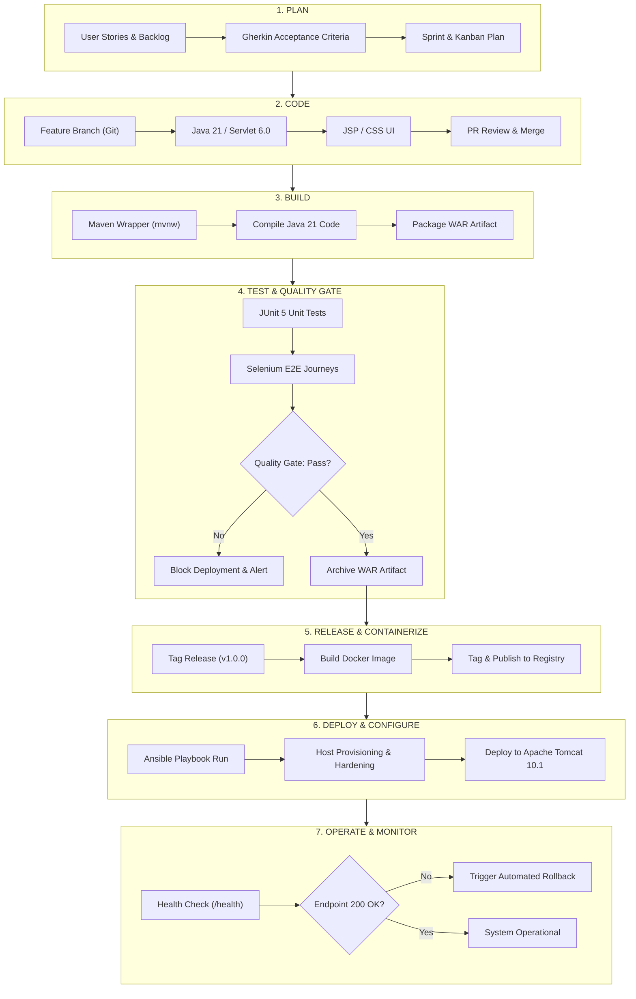

# User Stories, Backlog, Sprint Plan & DevOps Lifecycle

This document defines the agile software development plan, user stories with Gherkin acceptance criteria, sprint cadence, Kanban board states, Definition of Done (DoD), and the complete DevOps lifecycle for the **Business Licence Renewal System**.

---

## 1. User Stories & Acceptance Criteria

### Epic 1: Identity & Server-Enforced Role-Based Access Control (RBAC)

#### US-01: User Authentication & Role Detection
- **As a** registered system user (Business Owner or Licensing Officer),  
- **I want to** log in with my username and password,  
- **So that** I am authenticated and directed to my role-appropriate workspace.

```gherkin
Scenario: Successful login as a Business Owner
  Given I am on the login page "/login"
  When I enter valid Business Owner credentials "owner1" and "pass123"
  And I submit the login form
  Then the server establishes an authenticated session with role "BUSINESS_OWNER"
  And I am redirected to the Owner Dashboard "/owner/dashboard"

Scenario: Successful login as a Licensing Officer
  Given I am on the login page "/login"
  When I enter valid Licensing Officer credentials "officer1" and "pass123"
  And I submit the login form
  Then the server establishes an authenticated session with role "LICENSING_OFFICER"
  And I am redirected to the Officer Review Queue "/officer/dashboard"

Scenario: Invalid credentials rejection
  Given I am on the login page "/login"
  When I enter invalid credentials
  And I submit the login form
  Then the server rejects the request with HTTP 401 or displays an error message "Invalid username or password"
  And no authenticated session is created
```

#### US-02: Server-Side Horizontal Data Isolation
- **As a** Business Owner,  
- **I want** the system to prevent any access to licence applications filed by other businesses,  
- **So that** commercial confidentiality and privacy are strictly preserved.

```gherkin
Scenario: Business Owner attempts to view another owner's record
  Given I am logged in as Business Owner "owner1"
  When I attempt to access record details for record ID "99" belonging to "owner2" via direct URL manipulation
  Then the server verifies the record ownership against my session user ID
  And the server returns HTTP 403 Forbidden with an error message "Access denied: unauthorized record"
```

---

### Epic 2: Licence Application Lifecycle & CRUD Operations

#### US-03: Create Licence Renewal Application
- **As a** Business Owner,  
- **I want to** submit a new licence renewal application with my business details,  
- **So that** the licensing authority can review my renewal request before my current licence expires.

```gherkin
Scenario: Successful renewal submission with valid data
  Given I am logged in as Business Owner "owner1"
  And I am on the renewal application page "/owner/renew"
  When I fill in the form with:
    | Field                     | Value                     |
    | Business Name             | Apex Retailers Ltd        |
    | Registration Number       | REG-2024-8841             |
    | Trade Category            | General Retail            |
    | Current Expiry Date       | 2026-12-31                |
    | Annual Turnover (INR)     | 4500000                   |
    | Contact Email             | contact@apexretail.in     |
  And I submit the application
  Then the server validates all required fields
  And persists the record with initial status "SUBMITTED" and an audit timestamp
  And displays a confirmation message "Application submitted successfully" with a tracking ID
```

#### US-04: View & Search Personal Licence Applications
- **As a** Business Owner,  
- **I want to** view a list of all my submitted renewal applications and search by registration number,  
- **So that** I can track progress and monitor upcoming expiry dates.

```gherkin
Scenario: Search personal renewal applications
  Given I am logged in as Business Owner "owner1"
  And I have submitted applications for "REG-2024-8841" and "REG-2023-1102"
  When I search for "8841" in my records table
  Then only the record with registration number "REG-2024-8841" is displayed
  And records belonging to other business owners are excluded
```

#### US-05: Update Pending Application
- **As a** Business Owner,  
- **I want to** edit contact details or turnover on an application that has status "SUBMITTED",  
- **So that** I can correct errors before an officer begins the review.

```gherkin
Scenario: Edit application while status is SUBMITTED
  Given I am logged in as Business Owner "owner1"
  And I have an application with status "SUBMITTED"
  When I update the turnover value and submit
  Then the server updates the application details and records a modification timestamp
```

---

### Epic 3: Officer Review & Decision Workflow

#### US-06: Officer Review Queue & Application Inspection
- **As a** Licensing Officer,  
- **I want to** browse a unified queue of all submitted renewal applications with filtering by status,  
- **So that** I can prioritize applications awaiting audit.

```gherkin
Scenario: Filter queue by status SUBMITTED
  Given I am logged in as Licensing Officer "officer1"
  When I navigate to the Officer Queue "/officer/dashboard"
  And I filter by status "SUBMITTED"
  Then the table lists all submitted applications from all business owners
  And displays applicant name, registration number, submission date, and status
```

#### US-07: Officer Decision with Mandatory Remarks
- **As a** Licensing Officer,  
- **I want to** approve or reject a renewal application and attach mandatory justification remarks,  
- **So that** applicants are notified of the outcome and an official audit trail is maintained.

```gherkin
Scenario: Approve renewal application
  Given I am logged in as Licensing Officer "officer1"
  And I am reviewing application "APP-1001" with status "SUBMITTED"
  When I select "APPROVE", enter remarks "All compliance documents verified", and submit
  Then the application status transitions to "APPROVED"
  And the reviewer ID "officer1", approval timestamp, and remarks are stored permanently

Scenario: Reject renewal application requires remarks
  Given I am logged in as Licensing Officer "officer1"
  And I am reviewing application "APP-1002" with status "SUBMITTED"
  When I select "REJECT" without entering remarks
  Then the server blocks the action and displays "Remarks are mandatory for application decisions"
```

---

### Epic 4: Dashboard & Metrics Reporting

#### US-08: Summary Metrics Dashboard
- **As an** Officer or Administrator,  
- **I want to** view a summary dashboard with key renewal statistics,  
- **So that** I can gauge current processing throughput and backlog volume.

```gherkin
Scenario: View summary metrics counters
  Given I am logged in as an Officer
  When I view the dashboard
  Then I see dynamic metric cards for:
    | Metric Card          | Description                                  |
    | Total Applications   | Count of all records in the system           |
    | Pending Review       | Count of applications with status SUBMITTED  |
    | Approved             | Count of applications with status APPROVED   |
    | Rejected             | Count of applications with status REJECTED   |
```

---

## 2. Product Backlog & MoSCoW Prioritization

| Priority | ID | User Story / Task Description | Target Sprint | Story Points |
|---|---|---|---|---|
| **Must Have** | US-01 | User authentication with server-enforced `OWNER` and `OFFICER` roles | Sprint 2 | 5 |
| **Must Have** | US-02 | Server-side horizontal data isolation (owners access only their own records) | Sprint 2 | 5 |
| **Must Have** | US-03 | Create and submit licence renewal records with server-side validation | Sprint 3 | 5 |
| **Must Have** | US-04 | View and search licence renewal records | Sprint 3 | 3 |
| **Must Have** | US-05 | Update draft/pending licence applications | Sprint 3 | 3 |
| **Must Have** | US-06 | Officer review queue with status filtering | Sprint 3 | 5 |
| **Must Have** | US-07 | Officer approval and rejection actions with mandatory remarks | Sprint 3 | 5 |
| **Must Have** | US-08 | Summary dashboard with real-time application metrics | Sprint 3 | 3 |
| **Must Have** | CI-01 | Maven Wrapper and Jakarta EE 10 skeleton setup on Java 21 | Sprint 1 | 3 |
| **Must Have** | CI-02 | Jenkins pipeline with parameterized environment deployment | Sprint 4 | 5 |
| **Must Have** | QA-01 | 3–5 Selenium automated journeys with screenshot on failure | Sprint 4 | 8 |
| **Must Have** | QA-02 | Quality gate blocking Jenkins deployment on test failure & defect demo | Sprint 4 | 5 |
| **Must Have** | OPS-01| Dockerfile, container build, port mapping, and lifecycle operations | Sprint 5 | 5 |
| **Must Have** | OPS-02| Ansible playbook for provisioning, idempotency, health check, rollback | Sprint 5 | 8 |
| **Should Have**| ENH-01| Export renewal record summary to downloadable text/CSV format | Future | 3 |
| **Could Have** | ENH-02| Dark mode interface toggle | Future | 2 |
| **Won't Have**  | EXT-01| Live third-party payment gateway integration | Out-of-Scope | - |

---

## 3. Sprint Cadence & Iteration Plan

```
Sprint 1: Architecture, Planning & Web App Skeleton (Current)
   ├── Deliverables: Docs, SRS, Architecture, Maven Wrapper, Java 21 WAR skeleton, Health Servlet
   └── Exit Criteria: Skeleton compiles and packages cleanly with Maven Wrapper on Windows

Sprint 2: Authentication, Security Filters & Domain Model
   ├── Deliverables: User model, Password hashing, Role filter, Session auth, Horizontal scoping
   └── Exit Criteria: Owner and Officer login work with server-enforced access boundaries

Sprint 3: Licence Operations, Review Workflow & Dashboard
   ├── Deliverables: Licence CRUD, Search filter, Officer approval/rejection with remarks, Metrics
   └── Exit Criteria: Full business renewal workflow operational locally on Tomcat

Sprint 4: Jenkins CI/CD & Selenium Test Automation
   ├── Deliverables: Jenkinsfile, Parameterized deployment, 3-5 Selenium journeys, Quality Gate
   └── Exit Criteria: Automated build, test reports in Jenkins, deployment blocked on defect

Sprint 5: Docker Containerization & Ansible Configuration Management
   ├── Deliverables: Dockerfile, versioned image, Ansible playbook, idempotency, rollback demo
   └── Exit Criteria: Complete end-to-end automated deployment and rollback verified
```

---

## 4. Kanban Workflow States

Every task, feature, and bug moves strictly through the following six Kanban columns:

1. **Backlog**: Prioritized user stories and DevOps requirements awaiting grooming.
2. **Ready**: Fully specified with acceptance criteria, ready for active implementation.
3. **In Progress**: Actively being implemented on a dedicated feature branch (`feature/<name>`).
4. **Code Review / PR**: Pull request opened, peer-reviewed, and checked against standards.
5. **Testing & QA**: Automated unit tests and Selenium journeys executed; quality gates evaluated.
6. **Done**: Merged into branch, deployed to target, verified against Definition of Done.

---

## 5. Definition of Done (DoD)

A user story or deliverable is marked as **Done** if and only if all following criteria are satisfied:

- [ ] **Code Quality**: Written in Java 21, adhering to Jakarta EE conventions, formatted cleanly with no compiler warnings.
- [ ] **Security**: Server-side role checks and input sanitization applied on all HTTP endpoints.
- [ ] **Unit Testing**: Unit tests written for business logic and DAOs with all assertions passing.
- [ ] **Build Integrity**: Project builds cleanly using `./mvnw.cmd clean package` producing zero errors.
- [ ] **Version Control**: Committed to a feature branch with descriptive conventional commit messages, reviewed via PR, and merged without unhandled conflicts.
- [ ] **Documentation**: Relevant user stories, API tables, or deployment instructions updated.
- [ ] **Automation**: Passes through the automated CI pipeline stages without manual intervention.

---

## 6. End-to-End DevOps Lifecycle Diagram


